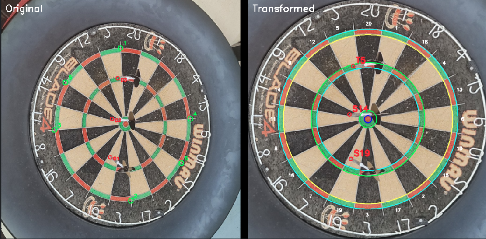

# OpenDarts

OpenDarts is a comprehensive dart application for playing, practicing, and socializing with fellow dart enthusiasts. The app provides everything you need for a complete dart experience, from game management and score tracking to social features and automated scoring capabilities.

## Components

### Mobile App
React Native/Expo mobile application for comprehensive dart game management, practice sessions, and social interaction.



**Demo Video:**


### AutoScore Server
Python WebSocket server that enables automated scoring through YOLO models for auto scoring.

**Features:**
- Automatic dartboard calibration
- Real-time scoring calculation
- Command-line tools for testing and calibration

### Backend
Kotlin Spring Boot backend for game management and stabilization of auto scoring results.

## Technology Stack

- **Mobile App**: React Native, Expo, TypeScript
- **Backend**: Kotlin, Spring Boot, Maven for game and user management
- **AutoScore Server** Python, WebSockets, OpenCV, YOLO, Ultralytics

## Getting Started

### Prerequisites
- Node.js 20+
- Python 3.11-3.12
- Java 21+
- uv (Python package manager)

### Setup

1. **AutoScore Server**
   ```bash
   cd autoscore-server
   uv sync --dev
   uv run python -m autoscore.main
   ```

2. **Mobile App**
   ```bash
   cd app/open-darts-app
   npm ci
   npx expo start
   ```

3. **Backend**
   ```bash
   cd backend
   mvn spring-boot:run
   ```

## How It Works

**Auto-Scoring**
1. The mobile app captures images of the dartboard using the device camera
2. Images are sent to the AutoScore Server via WebSocket connection
3. The server uses YOLO models to detect darts and calculate scores automatically
4. Scoring results are sent back to the mobile app in real-time

## License

This project is licensed under the Creative Commons Attribution-NonCommercial-ShareAlike 4.0 International License. See the [LICENSE](LICENSE) file for details.

## Acknowledgments

Dart detection model and portions of the codebase adapted from [dart-sense](https://github.com/bnww/dart-sense). Built with [Ultralytics YOLO](https://github.com/ultralytics/ultralytics) for object detection and OpenCV for image processing.
