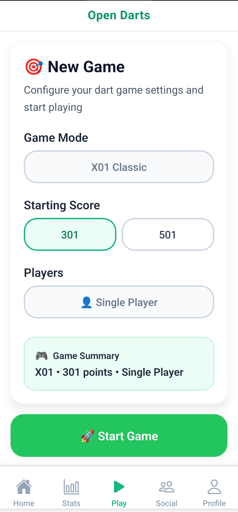
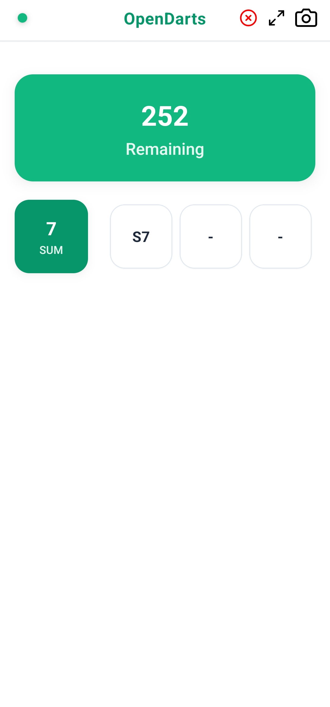

<<<<<<< HEAD
# OpenDarts

OpenDarts is a comprehensive dart application for playing, practicing, and socializing with fellow dart enthusiasts. The app provides everything you need for a complete dart experience, from game management and score tracking to social features and automated scoring capabilities.

## Features

- Automatic score detection through camera
- Multiple game modes including 301, 501, Cricket, Around the Clock, and more
- Real-time score tracking
- Player statistics and history
- Manual and automated score entry
- Practice mode with performance tracking
- Social features for connecting with other players
- Game history and statistics
- Real-time camera capture for auto-scoring
- Customizable game settings and rules

## Components

### Mobile App
React Native/Expo mobile application for comprehensive dart game management, practice sessions, and social interaction.





### AutoScore Server
Optional Python WebSocket server that enables automated scoring through computer vision and YOLO models for users who want hands-free scoring.

**Features:**
- WebSocket-based image processing
- High-accuracy dart detection using YOLO
- Automatic dartboard calibration
- Real-time scoring calculation
- Command-line tools for testing and calibration

### Backend
Java Spring Boot backend for comprehensive game management, user profiles, and social features. It provides RESTful APIs and WebSocket connections to manage dart game sessions, player statistics, and match history.

**Features:**
- RESTful API for game management
- User authentication and player profiles
- Social features (friends, challenges, leaderboards)
- Game statistics and performance analytics
- Tournament and league management
- Achievement system
- Database integration for persistent data
- Real-time game updates via WebSockets for live scoring and state synchronization
- Automatic scoring logic for various X01 games
- Game state management and stabilization to ensure consistent data handling

## Architecture

```
Mobile App (React Native)
    ↓ REST API
Backend (Java Spring Boot)
    ↓
Database

Optional for Auto-Scoring:
Mobile App (React Native) 
    ↓ WebSocket
AutoScore Server (Python)
```

## Technology Stack

- **Mobile App**: React Native, Expo, TypeScript, Zustand for state management
- **Backend**: Java, Spring Boot, Maven for game and user management
- **AutoScore Server** (Optional): Python, WebSockets, OpenCV, YOLO, Ultralytics
- **Computer Vision** (Optional): YOLO models for automated dart detection

## Getting Started

### Prerequisites
- Node.js 20+
- Python 3.11-3.12
- Java 21+
- uv (Python package manager)

### Setup

1. **AutoScore Server**
   ```bash
   cd autoscore-server
   uv sync --dev
   uv run python -m autoscore.main
   ```

2. **Mobile App**
   ```bash
   cd app/open-darts-app
   npm ci
   npx expo start
   ```

3. **Backend**
   ```bash
   cd backend
   mvn spring-boot:run
   ```

## How It Works

**Auto-Scoring (Optional):**
1. The mobile app captures images of the dartboard using the device camera
2. Images are sent to the AutoScore Server via WebSocket connection
3. The server uses YOLO models to detect darts and calculate scores automatically
4. Scoring results are sent back to the mobile app in real-time

## License

This project is licensed under the Creative Commons Attribution-NonCommercial-ShareAlike 4.0 International License. See the [LICENSE](LICENSE) file for details.

## Acknowledgments

Dart detection model and portions of the codebase adapted from [dart-sense](https://github.com/bnww/dart-sense). Built with [Ultralytics YOLO](https://github.com/ultralytics/ultralytics) for object detection and OpenCV for image processing.

