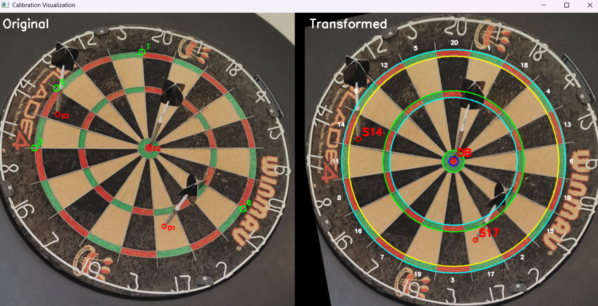

# 🎯 OpenDarts AutoScore

A comprehensive **WebSocket server** and **dart detection package** that processes dartboard images and returns scoring results using advanced computer vision and YOLO models. This unified solution provides both programmatic APIs and WebSocket communication for real-time dart detection and scoring.

Unlike other dart detection solutions on GitHub, this package is not designed to be a full-fledged dart game detection service. Instead, it focuses on providing interfaces for detecting darts in images and calculating scores, which can be integrated into larger applications through both WebSocket communication and direct API usage.

---

## 🚀 What It Does

- **WebSocket Server**: Send images of dartboards via WebSocket and receive scoring data in real time
- **Dart Detection Package**: High-accuracy dart detection using YOLO-based computer vision models
- **Automatic Scoring**: Calculate scores with dartboard calibration
- **Command Line Tools**: Quick dart scoring and calibration visualization

---

## ✨ Features

### WebSocket Server Features
- 🔌 **WebSocket-based communication** for real-time processing
- 🖼️ **Image processing** for dart detection
- 🎯 **Automatic scoring calculation** with live results
- ⚡ **Real-time results** with low latency

### Dart Detection Package Features  
- 🎯 **High-accuracy dart detection** using YOLO-based computer vision models
- 📊 **Automatic scoring calculation** with dartboard calibration
- ⚙️ **Configurable processing pipeline** with customizable settings
- 🖥️ **Command-line tools** for quick dart scoring and calibration visualization
- 📦 **Easy installation** via PyPI or uv package manager

---

## 🚀 Installation

Install the package:

```bash
pip install .
```

---

## 🛠️ Command Line Tools

The package includes two convenient command-line tools:

### **Dart Scorer CLI**

Score darts in images directly from the command line:

```bash
dart-image-scorer --help
```

### **Calibration Visualizer**

Visualize dartboard calibration and detection results:

```bash
dart-calibration-visualizer --help
```

---

## 🎯 How It Works

The dart detection system uses a multi-stage pipeline. Detailed explanation can be read here at [dart-sense](https://github.com/bnww/dart-sense):

1. **Image Preprocessing** - Optimizes input images for better model performance
2. **YOLO Detection** - Identifies dart locations using trained computer vision models
3. **Calibration** - Maps detected coordinates to dartboard scoring regions
4. **Scoring** - Calculates final scores based on dart positions


*Visualization of homogenous dartboard transformation with detected objects and scoring*

---

## 🙏 Acknowledgments

- Built with [Ultralytics YOLO](https://github.com/ultralytics/ultralytics) for object detection
- Uses OpenCV for image processing and computer vision operations
- Dart detection model and portions of the codebase adapted from [dart-sense](https://github.com/bnww/dart-sense) - special thanks to the original contributor for their excellent work on dart detection algorithms.
